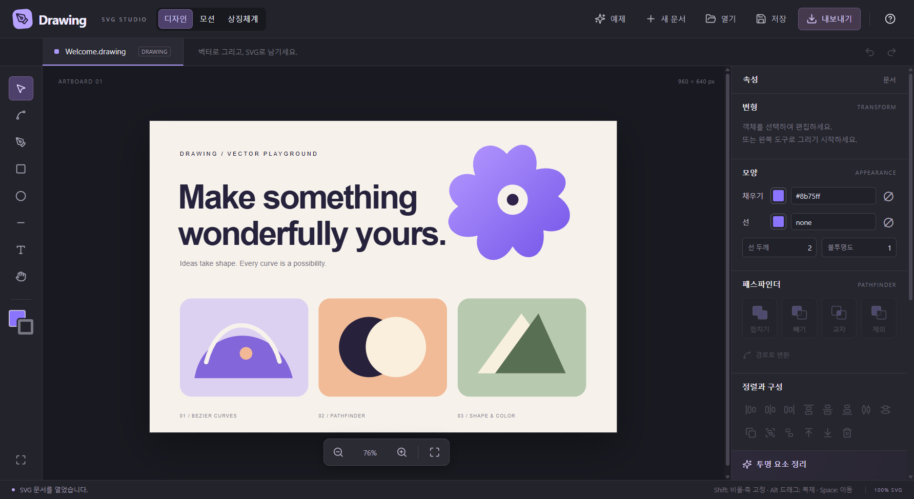
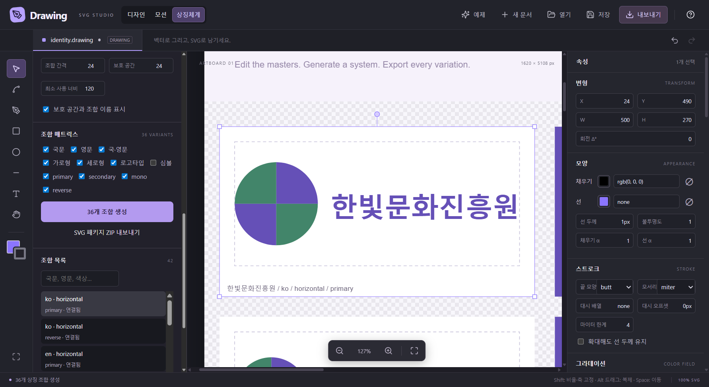

# Drawing

**SVG-native vector editing for Windows.** TypeScript · React · Electron · Paper.js

Drawing은 SVG 문서를 직접 편집하는 데스크톱 벡터 편집기입니다. 패스파인더,
완전히 투명한 요소 정리, Alt 드래그 복제와 펜·노드 편집을 제공합니다.



## 실행

[Releases](https://github.com/hslcrb/Drawing/releases)에서 `Drawing-1.2.0-win-x64.exe`를
다운로드하고 실행하세요. 최신 검증 버전은 **1.2.0**입니다. 설치와 Java 런타임 없이 실행하는 Windows x64 포터블 앱입니다.
현재 배포 파일은 코드 서명이 없는 자체 빌드입니다.

실행하면 **“Make something wonderfully yours.”** 예제 문서가 열립니다.
상단 **예제** 갤러리에서 소개·그라데이션·스트로크·타이포그래피·모션·상징체계, 여섯 원본 예제를 골라 여세요.
예제는 앱에 포함되어 별도 파일이 필요 없습니다. **새 문서**는 빈 아트보드를 만듭니다.
수정한 문서를 떠날 때는 저장 여부를 확인하며, 예제를 저장하면 새 파일로 저장합니다.
원본 SVG는 [samples/welcome.svg](samples/welcome.svg)에서도 확인할 수 있습니다.

## BI · 상징체계 · Retypo

**상징체계** 모드는 심볼과 국문·영문 로고타입을 연결 컴포넌트로 등록하고,
언어·가로/세로/로고타입/심볼·4가지 색상 조합을 일괄 생성합니다. 기본 36개
조합을 생성하며 원본 편집을 연결된 조합에 반영합니다. 개별 연결 해제, 보호 공간과
사용 규정, 언어/배치별 독립 SVG ZIP 전달을 지원합니다.

**Retypo**는 시스템/프로젝트 TTF·OTF의 실제 글리프와 Unicode 보고서를 보여주고,
선택한 경로 글자를 폰트 글리프와 비교해 후보와 형태 유사도를 표시합니다. 결과를
보정한 뒤 폰트를 포함한 실제 SVG 텍스트로 복원합니다. 변형되거나 겹친 글자는
직접 보정할 수 있습니다.

캔버스·레이어·속성·상단·타임라인에서 우클릭 메뉴를 제공합니다.
입력란에서는 복사/잘라내기/붙여넣기/전체 선택을 제공합니다.
[상징체계 및 Retypo 사용법](docs/identity-studio.md)



## 주요 기능

- **프로젝트:** 공개 JSON `.drawing` 형식. 내부 SVG, 이미지·폰트, 작업 화면과 타임라인을 함께 저장합니다. 기존 SVG 열기와 정적·애니메이션 SVG 내보내기도 지원합니다.
- **화면 복원:** 줌·스크롤·선택·레이어 펼침·도구·기본 색·속성 패널·디자인/모션/상징체계 모드·재생 위치.
- **리소스:** PNG·JPEG·WebP·GIF 이미지 포함. TTF·OTF 전체 글꼴 또는 사용 글리프를 HarfBuzz로 부분 포함.
- **그라데이션:** 채우기와 스트로크의 선형·방사형·자유형 점/선 색상 필드. 색상 스톱·알파·좌표·반경 및 캔버스 핸들 편집.
- **스트로크:** 두께·끝 모양·모서리·대시 배열·오프셋·마이터 한계·확대 시 두께 유지.
- **모션:** 객체별 위치·회전·크기·불투명도 키프레임, 선형·부드러운 보간·유지, 재생·반복·FPS·탐색. 디자인 원본을 보존합니다.
- **그리기:** 사각형, 타원, 선, 텍스트, 직선 및 베지어 곡선 펜.
- **노드:** 앵커·핸들 이동, 경로 더블클릭으로 점 추가, 선택 노드 삭제, 경로 열기·닫기.
- **선택:** 클릭·Shift 클릭·영역 선택, 이동·크기·회전 핸들, 수치 편집, Alt 드래그 복제.
- **스타일:** 채우기·선 색, 색 없음, 선 두께, 전체·채우기·선 불투명도, 텍스트 내용·글꼴·크기.
- **패스파인더:** 합치기, 빼기, 교차, 제외. 곡선·구멍·복합 경로·중첩 변형 처리.
- **구성:** 그룹·그룹 해제, 순서, 6방향 정렬, 수평·수직 간격 분배, 레이어 이름·숨김·잠금.
- **편집:** 실행 취소·다시 실행, 복사·잘라내기·붙여넣기, 복제, 삭제, 모두 선택.
- **보기:** 줌, 화면 맞춤, 손 도구, Space 드래그.

### 투명 요소 정리

오른쪽 패널의 **투명 요소 선택**은 검사 결과를 선택하고, **투명 요소 삭제**는 같은
기준으로 제거합니다. 삭제는 실행 취소 가능합니다.

검사는 `fill="none"` + `stroke="none"`, 색의 알파 0, 채우기·선 불투명도 0,
자신 또는 조상의 전체 불투명도 0을 구분합니다. 채우기가 생략된 도형에는 SVG 기본
검정색이 있으므로 삭제하지 않습니다. 선만 있는 도형도 유지합니다.

숨긴 레이어, 정의 리소스(`defs`, 마스크, 클리핑 등), 다른 요소에서 참조하는 객체는
보존합니다. 투명 여부가 확실하지 않은 그라디언트·패턴·필터는 추정하여 삭제하지 않습니다.

### 패스파인더 사용

닫힌 도형·경로를 2개 이상 선택하고 연산을 누릅니다. **빼기**는 가장 아래 객체에서
위 객체들의 영역을 제거합니다. 결과는 원래 위치의 실제 SVG 경로로 저장되며,
색상과 선은 아래 객체에서 가져옵니다. 빈 교차 결과는 선택 객체를 제거하는 정상 결과입니다.

텍스트·이미지, 열린 경로 및 필터·클리핑·마스크 효과의 패스파인더는 지원하지 않습니다.
이 경우 문서를 유지하고 오류를 표시합니다. Drawing 1.2는 여기 나열한 SVG 편집 기능을
제공하며 Illustrator의 모든 전문 기능(CMYK, 라이브 효과 등)을 구현한 제품은 아닙니다.

## 프로젝트·모션 사용

기본 **저장**은 `.drawing` 프로젝트를 저장합니다. 디자인 모드의 **내보내기**는
정적 SVG, 모션 모드의 **내보내기**는 브라우저에서 재생되는 애니메이션 SVG입니다.
프로젝트에는 편집 가능한 키프레임도 남습니다.

모션 모드에서 레이어를 선택하고 시간 0에 **키 저장**을 누릅니다. 다른 시간으로
이동해 X/Y·회전·크기·불투명도를 바꾸고 다시 **키 저장**을 누르세요. 다이아몬드를
클릭해 키로 이동하고 값을 덮어쓰거나 삭제할 수 있습니다.

폰트 부분 포함은 현재 문서의 문자와 추가 포함 문자를 대상으로 합니다. 저장 파일에는
원본 전체 글꼴을 숨겨 넣지 않습니다. 재열기 후 새 문자가 필요하면 해당 글꼴을 다시
포함하거나 전체 포함을 선택하세요. 자유형 그라데이션은 SVG 방사형 색상 필드 합성
방식이며 Illustrator의 전용 메쉬와 동일한 표현은 아닙니다.

[공개 포맷 설명](docs/project-format.md) · [JSON Schema](docs/drawing.schema.json) · [모션 화면](docs/motion.png) · [예제 갤러리](docs/examples.png)

## 단축키

| 작업 | 단축키 |
| --- | --- |
| 선택 / 노드 / 펜 | V / A / P |
| 사각형 / 타원 / 선 / 텍스트 / 손 | R / E / L / T / H |
| 펜 확정 / 취소 | Enter / Escape |
| 다중 선택 / 축·비율 고정 | Shift 클릭 / Shift 드래그 |
| 복제 이동 | Alt 드래그 |
| 복사 / 잘라내기 / 붙여넣기 | Ctrl+C / Ctrl+X / Ctrl+V |
| 복제 / 모두 선택 / 삭제 | Ctrl+D / Ctrl+A / Delete |
| 그룹 / 그룹 해제 | Ctrl+G / Ctrl+Shift+G |
| 앞으로 / 뒤로 | ] / [ (Shift: 맨 앞·맨 뒤) |
| 실행 취소 / 다시 실행 | Ctrl+Z / Ctrl+Shift+Z 또는 Ctrl+Y |
| 열기 / 새 문서 | Ctrl+O / Ctrl+N |
| 저장 / 다른 이름으로 저장 | Ctrl+S / Ctrl+Shift+S |
| 1px / 10px 이동 | 화살표 / Shift+화살표 |
| 화면 맞춤 / 확대·축소 | Ctrl+0 / Ctrl+휠 또는 줌 버튼 |
| 화면 이동 | Space 드래그 |

## 개발

Node.js 22.12 이상과 npm이 필요합니다.

```powershell
npm ci
npx playwright install chromium
npm run desktop
```

`npm run dev`는 브라우저 개발 화면을 실행합니다. 브라우저에서는 저장이 다운로드로,
열기가 파일 선택으로 동작합니다. 클립보드는 브라우저 권한이 필요할 수 있습니다.

```powershell
npm test                 # 타입 검사 + 제품 빌드 + 브라우저/Electron 테스트
npm run build            # renderer 빌드
npm run package          # Windows x64 포터블 EXE
npm run package:dir      # 포장되지 않은 Windows 앱 폴더
npm run format           # 소스 포맷
```

출력은 `release/`에 생성합니다. 아이콘을 다시 만들려면 `node scripts/icon.mjs`를 실행합니다.
테스트는 실제 Chromium과 Electron을 사용합니다. 파일 테스트는 시스템 대화상자의 경로
선택만 제어하고, 앱의 IPC·실제 디스크 저장·다시 열기 흐름을 실행합니다.

## 구조

- `src/core/editor.ts`: SVG 원본, 명령 기록, 선택·변형, ID 참조, 기하, 투명 요소 검사.
- `src/core/tools.ts`: 포인터 제스처, 펜·앵커·핸들 편집, 선택 오버레이.
- `src/core/project.ts`: 공개 프로젝트 타입과 로드 검증.
- `src/core/paints.ts`, `assets.ts`, `fonts.ts`: 편집 가능한 색상 필드와 내장 리소스.
- `src/core/motion.ts`, `Timeline.tsx`: 보간·키프레임·SVG 미리보기와 애니메이션 내보내기.
- `src/examples.ts`, `samples/`: 다섯 편집 가능한 예제.
- `src/main.tsx`: 도구·속성·레이어·파일 UI와 키보드 동작.
- `electron/`: 제한된 preload 브리지, 파일 I/O, 네이티브 대화상자와 클립보드.
- `tests/`: 문서·기하·브라우저 상호작용·데스크톱 파일 검증.

SVG를 열 때 실행 코드와 외부 실행 콘텐츠를 제거합니다. 편집 오버레이는 저장하지
않으며, 일반 SVG 요소·스타일·정의와 편집용 레이어 메타데이터를 저장합니다.

MIT License. Paper.js, Electron, React 등 의존 라이브러리의 라이선스는 배포 파일에 포함됩니다.
